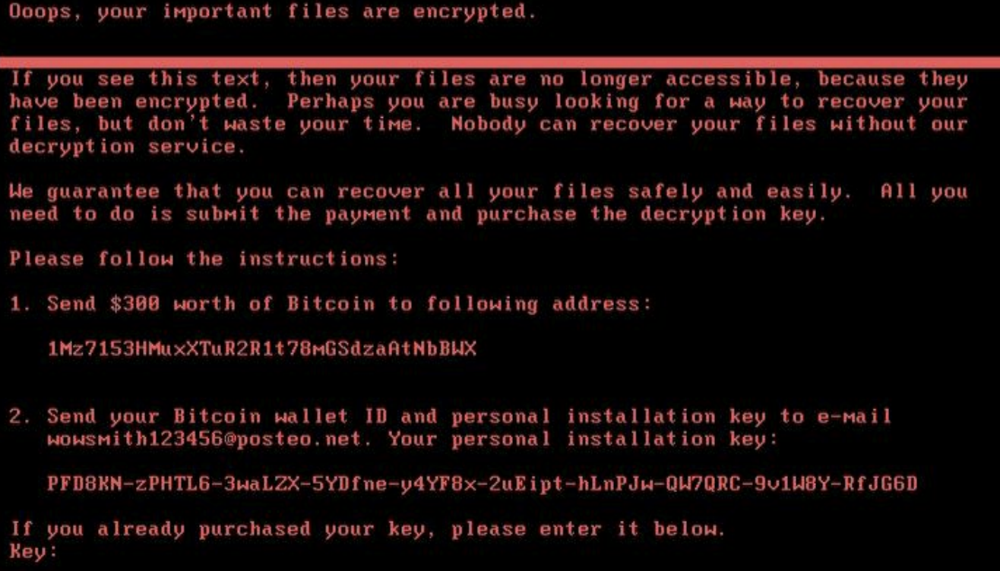
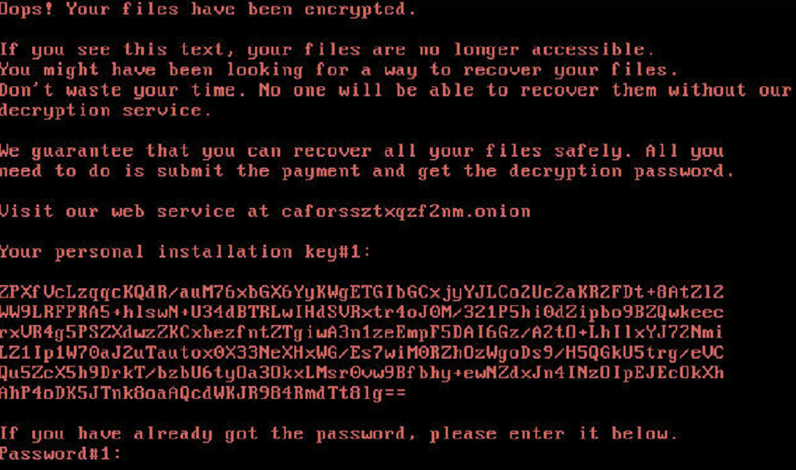

# Evaluation of Live Forensic Techniques in Ransomware Attack Mitigation
The objective of this paper is to explore whether techniques commonly used in real-time forensics can be applied to ransomware analysis. By doing so, investigators can discover useful encryption segments from the malware, enabling them to effectively reverse engineering the execution of ransomware.
## Environment
- Virtual Machine: VMWare
- OS: Windows 10
- Memory: 4GB RAM, 30GB Disk Capacity
## Tool
- *DumpIT*: A tool for saving the computer memory after executing Ransomware.
- *Volatility*: A tool for analyzing and recovering encrypted file.
- *aesfindkey*: A tool for finding AES key from dump file. 
## Research subjects
#### NotPeyta
NotPetya is a type of ransomware that encrypts files and demands a ransom for decryption. Discovered in June 2017, it initially appeared to be a variant of Petya ransomware but was found to be more destructive, as it not only encrypts but also destroys data, making recovery nearly impossible even if the ransom is paid.

#### Bad Rabbit
BadRabbit is a ransomware variant that emerged in late 2017, spreading through malicious websites and demanding ransom payments for decrypting encrypted data. Upon infection, it encrypts files on the system and requests payment in Bitcoin for decryption. BadRabbit is known to propagate through fake websites and often masquerades as a fake Adobe Flash Player update prompt. It caused significant disruptions primarily in Russia and Ukraine, crippling several critical infrastructure systems.

## Result
At first, dumping memory with *DumpIT*. After that, using *Votility* for observing encrypted files and find AES key with *aesfindkey*

The demo videos are stored in this [Link](https://drive.google.com/drive/u/1/folders/1mV6kxA7kAEAuGSYdnLElrLOHllFBCcOv)